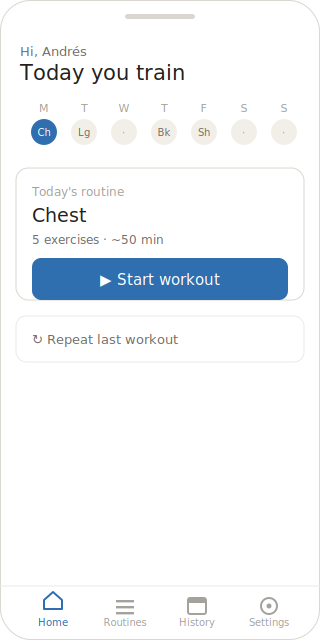
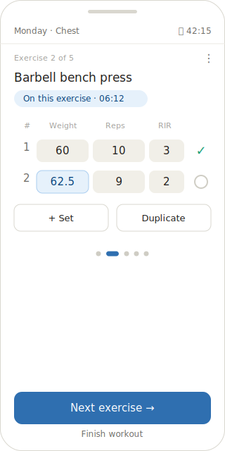
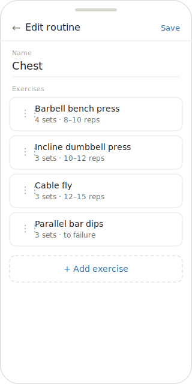
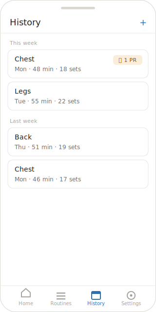
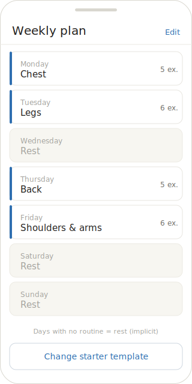
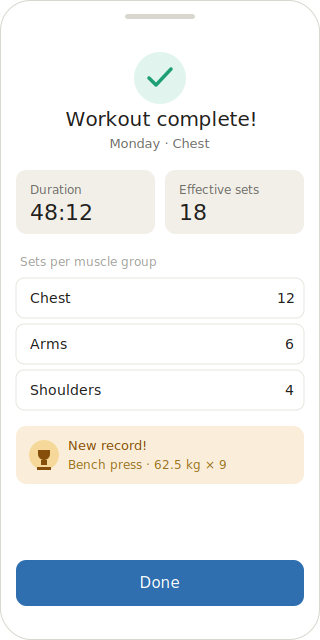
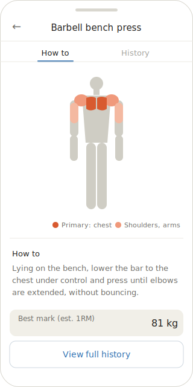

# UI Mockups

Mobile wireframes of RepLog in SVG. Style: light theme, wireframe; images live in `UI-Mockups/`. Reference for layout and hierarchy, not final design.

## Home
Today's routine + weekly strip + start/resume/repeat.

## Active session
Focused walkthrough: one exercise at a time, own timer, "Next exercise".

## Routine editor
Reorderable exercises with target sets×reps.

## History
Sessions by week, summarized by sets and with a PR badge.

## Weekly plan
Routines assigned to days; days with no routine = implicit rest.

## Session summary
Workout close: duration, effective sets, sets per muscle group, and PRs.

## Exercise detail
Muscle figure generated from `exercise_muscles` (primary intense, secondary faint) + short instruction.

